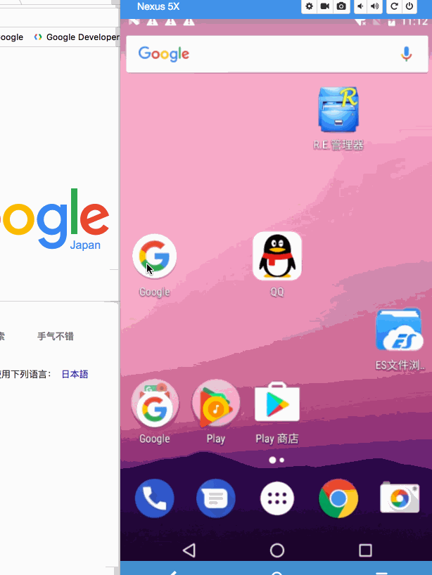
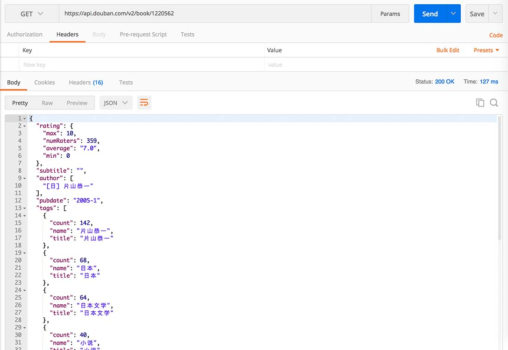
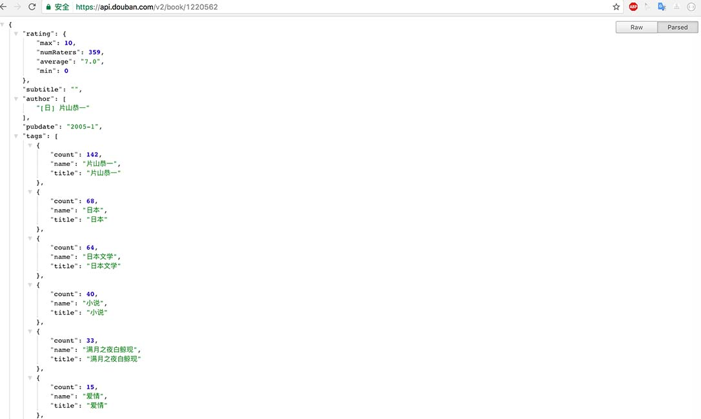
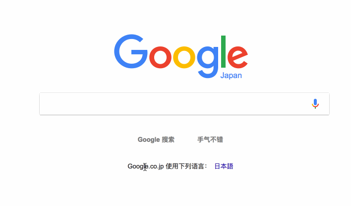
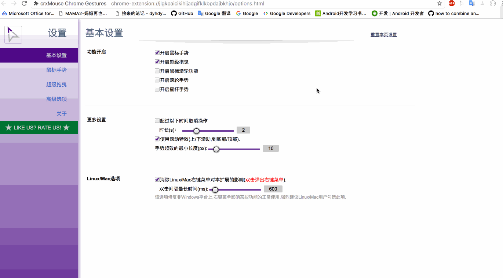
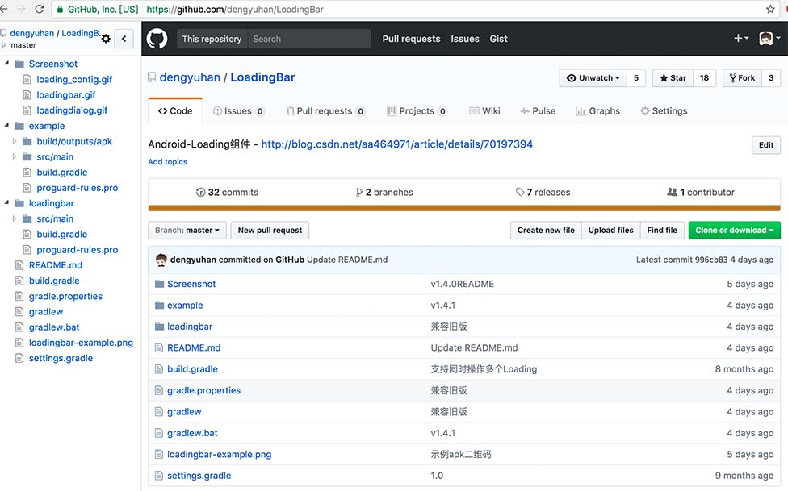
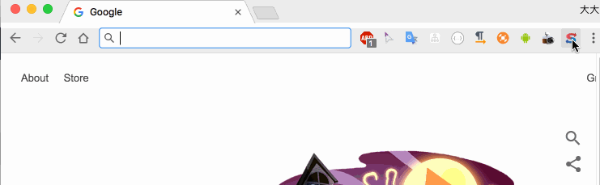
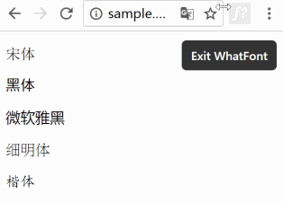
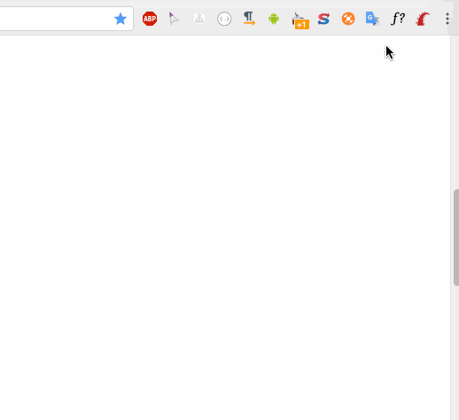
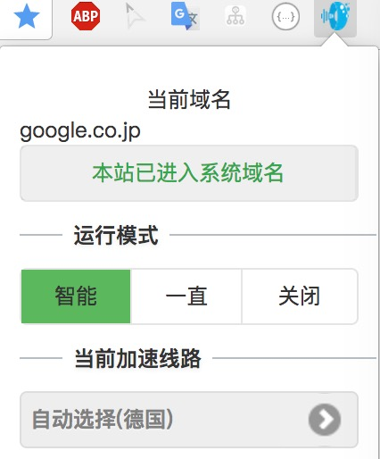

# Chrome-Plugin
程序猿必备的一些浏览器插件

### 1.Vysor
无需root就可以在浏览器上完全控制Android设备，Android程序猿必备
[https://chrome.google.com/webstore/detail/vysor/gidgenkbbabolejbgbpnhbimgjbffefm](https://chrome.google.com/webstore/detail/vysor/gidgenkbbabolejbgbpnhbimgjbffefm)

### 2.Postman
一款调试HTTP请求的工具，几乎可以发送所有类型的HTTP请求
[https://chrome.google.com/webstore/detail/postman/fhbjgbiflinjbdggehcddcbncdddomop](https://chrome.google.com/webstore/detail/postman/fhbjgbiflinjbdggehcddcbncdddomop)  

### 3.JSON Formatter
直接在浏览器上把Json格式化，便于浏览  
[https://chrome.google.com/webstore/detail/json-formatter/bcjindcccaagfpapjjmafapmmgkkhgoa](https://chrome.google.com/webstore/detail/json-formatter/bcjindcccaagfpapjjmafapmmgkkhgoa)  

### 4.Google翻译
可以划词划句翻译，看英文文档很方便  
[https://chrome.google.com/webstore/detail/google-translate/aapbdbdomjkkjkaonfhkkikfgjllcleb](https://chrome.google.com/webstore/detail/google-translate/aapbdbdomjkkjkaonfhkkikfgjllcleb)  

### 5.crxMouse Chrome Gestures
这是一个手势插件，可以设置多种手势进行快速操作，比如关闭标签、前进、后退  
终于不用再去点标签关闭按钮了  
[https://chrome.google.com/webstore/detail/crxmouse-chrome-gestures/jlgkpaicikihijadgifklkbpdajbkhjo](https://chrome.google.com/webstore/detail/crxmouse-chrome-gestures/jlgkpaicikihijadgifklkbpdajbkhjo)  

### 6.Octotree
以树形结构显示Github上的项目，更方便查看代码  
[https://chrome.google.com/webstore/detail/octotree/bkhaagjahfmjljalopjnoealnfndnagc](https://chrome.google.com/webstore/detail/octotree/bkhaagjahfmjljalopjnoealnfndnagc)  

### 7.Switcheroo-Redirector
替换Url，将指定的域名重定向到另外的域名  
图中是把`https://developers.android.com`重定向到了`https://developers.android.google.cn`  

[https://chrome.google.com/webstore/detail/switcheroo-redirector/cnmciclhnghalnpfhhleggldniplelbg?hl=zh-CN](https://chrome.google.com/webstore/detail/switcheroo-redirector/cnmciclhnghalnpfhhleggldniplelbg?hl=zh-CN) 

### 8.WhatFont
可以显示你当前网页用的是什么字体  
[https://chrome.google.com/webstore/detail/whatfont/jabopobgcpjmedljpbcaablpmlmfcogm](https://chrome.google.com/webstore/detail/whatfont/jabopobgcpjmedljpbcaablpmlmfcogm)

### 9.Wappalyzer
可以显示出当前网页用了哪些框架技术
[https://chrome.google.com/webstore/detail/wappalyzer/gppongmhjkpfnbhagpmjfkannfbllamg](https://chrome.google.com/webstore/detail/wappalyzer/gppongmhjkpfnbhagpmjfkannfbllamg)

### 10.快速安全通道
翻墙插件，既免费也有收费服务  
[https://chrome.google.com/webstore/detail/faststunnel-vpn-unblack-s/bblcccknbdbplgmdjnnikffefhdlobhp](https://chrome.google.com/webstore/detail/faststunnel-vpn-unblack-s/bblcccknbdbplgmdjnnikffefhdlobhp)  

